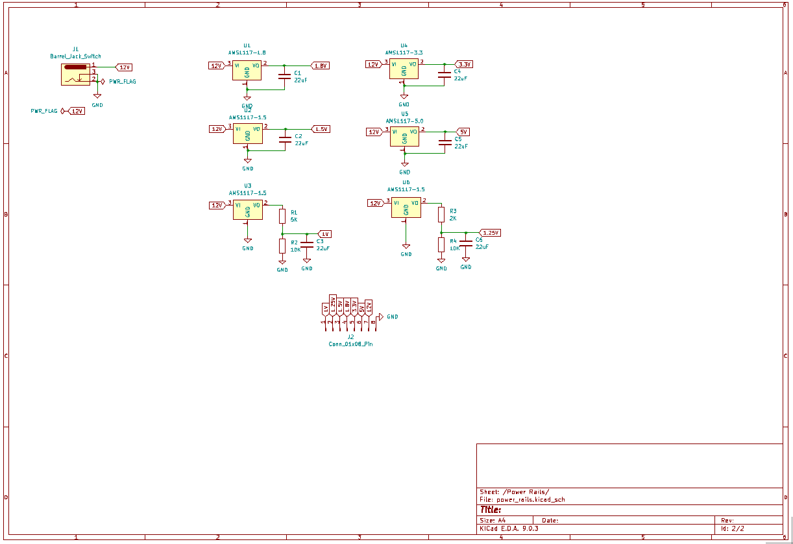
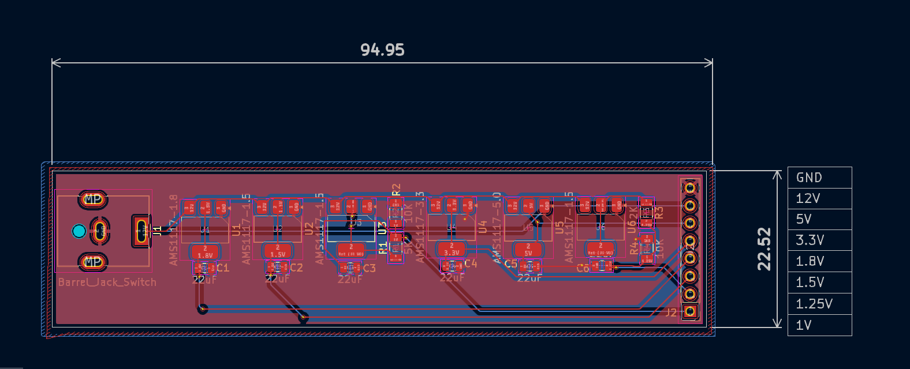

# Zynq-7000 Development Board (KiCad project)

This repository contains the KiCad project files for a Zynq-7000 development board. The design provides the typical power rails and connectors needed to evaluate and develop with Zynq-7000 series devices.

Files of interest
- `zynq-7000-development-board.kicad_sch` - top-level schematic
- `power_rails.kicad_sch` - power supply sheets and regulator circuitry
- `zynq-7000-development-board.kicad_pcb` - PCB layout
- `exports/` - generated Gerber/DRL and manufacturing outputs

Power rails

The schematic (`power_rails.kicad_sch`) defines the following primary nets and rails used by the board. These names come directly from global labels and regulator parts found in the power sheet.

- 12V (input)
  - Primary input rail; a barrel jack with internal switch (`J1`) is present in the power sheet. Global labels named `12V` route this input around the power page.

- 5V
  - Generated by an AMS1117-5.0 regulator (part: `U5`). Global label: `5V`.

- 3.3V
  - Generated by an AMS1117-3.3 regulator (part: `U4`). Global label: `3.3V`.

- 1.8V
  - Generated by an AMS1117-1.8 regulator (part: `U1`). Global label: `1.8V`.

- 1.5V
  - Several AMS1117-1.5 regulators are present (parts: `U2`, `U3`, `U6`, etc.) producing `1.5V` rails where required. Global labels: `1.5V`.

- 1.25V and 1.0V
  - Net labels `1.25V` and `1V` appear in the power sheet (these are typically used by certain Zynq fabric or memory rails). No dedicated fixed AMS1117 parts for 1.25V/1.0V are present in this power sheet; verify whether those rails are supplied by separate on-board regulators, programmable regulators on another sheet, or expected from an external source. Treat these rails as critical for the Zynq core/memory and confirm their sourcing before powering the device.

- GND (Ground)
  - Global `GND` power symbols and multiple PWR_FLAG symbols are present to indicate power sources for ERC.

Notes about components and decoupling
- Several decoupling/bulk capacitors (example: `C1`..`C6`) with value `22uF` are placed near regulators and nets.
- A small set of resistors (e.g., `R1`, `R2`, `R3`, `R4`) appear in the power sheet for sensing, pull-ups/pull-downs or divider uses. Values seen include `5K`, `10K`, `2K`.
- Power markers (`PWR_FLAG`) are included to inform KiCad ERC about power sources.

Important cautions and checklist before powering
- Confirm sources for `1.25V` and `1.0V` nets — the `power_rails.kicad_sch` file contains labeled nets but no obvious fixed regulators for those voltages in the same file. If these rails are required by the Zynq device (VCCINT, memory rails, etc.), supply them from a verified regulator or set the jumpers/configuration accordingly.
- Verify regulator input voltage and power dissipation: some linear regulators (AMS1117 family) are used; if fed from 12V they will dissipate significant power when dropping to lower voltages. Consider switching regulators if heat or efficiency is a concern.
- Run ERC (Electrical Rules Check) in KiCad and inspect inter-sheet connections before build.

How to use this repo
1. Open the project in KiCad 7 (or compatible Eeschema / PCBNew version).
2. Run ERC on each schematic sheet and inspect power net connectivity.
3. Review the PCB layout and keepout areas located in `zynq-7000-development-board.kicad_pcb`.
4. Use the `exports/` folder for the Gerbers and drill files when ready to manufacture.

Notes / next steps (recommended)
- Add explicit documentation in the schematics or a dedicated README section about where `1.25V` and `1V` are generated from (if from an external module or another schematic sheet).
- Consider adding a power-budget calculation and regulator thermal check to the repository.

If you'd like, I can also:
- Add a short power-budget spreadsheet to the repo.
- Scan other schematic sheets to find where `1.25V`/`1V` are actually generated if they are present on different pages.

